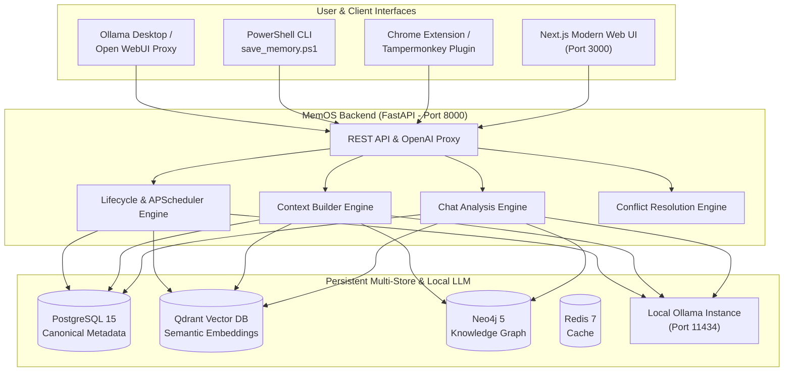

# MemOS: Adaptive Memory Lifecycle Management Framework

[](https://fastapi.tiangolo.com)
[](https://nextjs.org)
[](https://www.postgresql.org)
[](https://qdrant.tech)
[](https://neo4j.com)
[](https://redis.io)
[](https://ollama.com)

**MemOS** is an autonomous, persistent long-term memory framework built for local Large Language Models (LLMs) and companion agent applications. It extends local LLMs (such as Ollama with Llama 3, Qwen, or Mistral) with multi-store memory indexing, automated conversation analysis, real-time knowledge graph extraction, semantic vector search, dynamic importance decay, adaptive compression, and conflict resolution.

### 🧠 What Data MemOS Stores
MemOS is a **local-first, privacy-preserving** memory system. Everything it learns stays on your machine (or your docker host); no conversation transcripts, vectors, or graph triples ever leave for the cloud. Concretely, MemOS persists:

| Data Kind | Where It Lives | Contents |
| :--- | :--- | :--- |
| **Users & Auth** | PostgreSQL / SQLite (`users`) | JWT-auth'd user accounts (email, username, bcrypt password hash) |
| **Conversations** | PostgreSQL / SQLite (`chats`, `messages`) | Chat sessions, titles, and full user/assistant message history |
| **Canonical Memories** | PostgreSQL / SQLite (`memories`) | The memory content plus lifecycle metadata (importance, confidence, access count, tags, entities, status, collection, project, pinned flag) |
| **Semantic Vectors** | Qdrant (`memory_vectors`) | Dense 768-dim embeddings (via `nomic-embed-text`) with cosine similarity; filtered by `user_id` + `status` |
| **Knowledge Graph** | Neo4j (`User`, `Project`, `Technology`, `Skill`, `Concept` nodes and triple edges) | Entity-relationship facts like `(User)-[:USES]->(Qdrant)` scoped per user |
| **User Profile** | PostgreSQL / SQLite (`user_profiles`) | Auto-learned languages, frameworks, projects, skills, interests, writing style, goals |
| **Analysis History** | PostgreSQL / SQLite (`analysis_history`) | Audit log of every chat analysis / memory-optimization run with counts |
| **Session Cache** | Redis | Low-latency session lookup (optional, graceful if absent) |

> **Dual deployment mode:** If PostgreSQL (or the other stores) is reachable it is used; otherwise the backend automatically falls back to a local **SQLite** file (`backend/memos_local.db`) plus an in-memory / optional Qdrant — enabling a lightweight standalone "companion" mode with no Docker required.

---

## 🌟 Key Highlights & Capabilities

- **🧠 Multi-Store Memory Architecture**:
  - **Relational Metadata (PostgreSQL)**: Canonical storage for user profiles, conversation history, memory status, and scoring metrics.
  - **Vector Search (Qdrant)**: High-dimensional semantic vector indexing and similarity retrieval using local embeddings (`nomic-embed-text`).
  - **Knowledge Graph (Neo4j)**: Entity-relationship graph extraction and associative link exploration across conversations.
  - **Fast Cache (Redis)**: Low-latency caching for active sessions and lifecycle jobs.
- **⚡ Automated Chat Analysis & Memory Optimization**:
  - **🧠 Analyze Chat**: Parses conversation transcripts, ignores greetings and small talk, extracts structured facts/technologies/projects/skills, eliminates duplicates, and updates graph triples.
  - **🧹 Optimize Memory**: Sweeps the entire memory store, recalculates importance scores, triggers LLM compression on stale memories, and cleans up contradictory facts.
  - **🤖 Automatic & Scheduled**: Every chat turn in the UI/proxy automatically triggers background memory extraction (non-blocking `BackgroundTasks`), and an **APScheduler** job runs nightly to recalculate importance, compress stale memories, and run adaptive forgetting — no manual maintenance required.
- **🎯 Dynamic Context Augmentation & Personalization**:
  - Automatically enriches prompts with relevant semantic memories, knowledge graph triples, user profile preferences, active projects, and pinned notes before calling Ollama.
- **⏳ Adaptive Memory Lifecycle Engine**:
  - **Importance Scoring**: Mathematical weighted decay ($Recency \times 0.3 + Frequency \times 0.3 + Entity \times 0.2 + Confidence \times 0.2 + Pin$).
  - **Memory Compression**: Synthesizes older memories into compact summaries via LLM.
  - **Unified Multi-Store Deletion**: Hard deletion synchronized across PostgreSQL, Qdrant, and Neo4j (no ghost memories).
- **🔌 1-Button Ollama Desktop & Proxy Bridge**:
  - **OpenAI Proxy (`/v1/chat/completions` & `/v1/models`)**: Drop-in OpenAI-compatible streaming proxy (SSE) on port `11435` / `8000`.
  - **Windows Bridge (`scripts/start_bridge.bat`)**: 1-click local connection detector and proxy launcher.
  - **PowerShell CLI (`scripts/save_memory.ps1`)**: Push memories directly from your shell.
  - **Browser Extension**: 1-click memory sharing from ChatGPT, Claude, or WebUIs.

---

## 🏗️ System Architecture



---

## 📂 Project Structure

```
MemOs/
├── backend/
│   ├── Dockerfile
│   ├── requirements.txt
│   ├── app/
│   │   ├── main.py                     # FastAPI entrypoint, health endpoints & scheduler startup
│   │   ├── api/                        # API route controllers
│   │   │   ├── auth.py                 # JWT User authentication, registration & login
│   │   │   ├── chats.py                # Chat session storage, streaming & background extraction
│   │   │   ├── dashboard.py            # Real-time metrics & memory distribution
│   │   │   ├── deps.py                 # Security dependencies & companion fallbacks
│   │   │   ├── graph.py                # Knowledge graph retrieval endpoints
│   │   │   ├── memory.py               # Memory store/search/analyze/optimize/delete endpoints
│   │   │   ├── ollama.py               # Ollama status/models, chat, streaming & share-memory hook
│   │   │   ├── profile.py              # User profile & preferences
│   │   │   └── proxy.py                # OpenAI-compatible proxy (/v1/models & /v1/chat/completions, SSE)
│   │   ├── core/                       # Configuration (Pydantic settings) & JWT security
│   │   ├── database/                   # SQLAlchemy engine & SQLite fallback session
│   │   ├── models/                     # ORM models (User, Chat, Message, MemoryModel, UserProfile, AnalysisHistory)
│   │   ├── schemas/                    # Pydantic request/response schemas
│   │   ├── services/                   # Business logic & external service connectors
│   │   │   ├── analysis_service.py     # Conversation parsing, entity/fact extraction & profile updates
│   │   │   ├── conflict_service.py     # Contradiction detection engine
│   │   │   ├── context_builder.py      # Personalized prompt context assembly
│   │   │   ├── graph_service.py        # Neo4j Cypher query manager
│   │   │   ├── importance_service.py   # Memory importance scoring formula
│   │   │   ├── lifecycle_service.py    # Compression & adaptive-forgetting engines
│   │   │   ├── memory_service.py       # Dual-storage (Postgres/JSON + Qdrant) indexing, search, unified delete
│   │   │   ├── ollama_service.py       # Ollama status/chat/stream/embedding client
│   │   │   └── qdrant_service.py       # Qdrant collection & search manager
│   │   └── workers/
│   │       └── scheduler.py            # APScheduler nightly memory lifecycle jobs (importance, compression, forgetting)
│   └── tests/                          # Pytest unit, integration, proxy & security tests
│       ├── test_analysis_service.py
│       ├── test_full_pipeline.py
│       ├── test_multi_tenant_security.py
│       ├── test_ollama_proxy.py
│       ├── test_personalized_context.py
│       └── test_profile_service.py
├── frontend/
│   ├── Dockerfile
│   ├── package.json
│   ├── next.config.js
│   ├── tailwind.config.js
│   ├── tsconfig.json
│   └── src/
│       ├── app/                        # Next.js 14 App router
│       │   ├── globals.css             # Theme styles & scrollbar setup
│       │   ├── layout.tsx              # Root HTML wrapper
│       │   └── page.tsx                # Main workspace container
│       └── components/                 # UI Tabs & Modals
│           ├── AnalysisModal.tsx       # Multi-step animated chat analysis modal
│           ├── ChatTab.tsx             # Interactive chat with personalization toggle
│           ├── DashboardTab.tsx        # Memory distribution & metrics cards
│           ├── GraphTab.tsx            # Neo4j entity & knowledge triple explorer
│           ├── OllamaIntegrationPanel.tsx  # Live Ollama/proxy status, model picker, 1-click bridge
│           ├── SearchTab.tsx           # Semantic vector search & memory table
│           ├── Sidebar.tsx             # Navigation sidebar
│           ├── UserProfileTab.tsx      # Auto-learned profile editor
│           └── types.ts                # TypeScript data interfaces
├── scripts/
│   ├── extension/                      # Chrome / Edge / Brave Extension (Manifest V3)
│   │   ├── manifest.json
│   │   └── content.js
│   ├── memos_bridge.py                 # Windows local bridge proxy (port 11435)
│   ├── start_bridge.bat                # 1-click Windows bridge launcher
│   ├── memos_browser_plugin.user.js    # Tampermonkey / Greasemonkey userscript
│   ├── save_memory.ps1                 # PowerShell CLI helper script
│   ├── benchmark.py                    # Benchmark harness wrapper
│   └── real_benchmark.py               # Empirical benchmark (Raw LLM vs Basic RAG vs MemOS)
├── docs/                               # Detailed technical documentation
│   ├── ARCHITECTURE.md
│   ├── BENCHMARKING.md
│   ├── BENCHMARK_RESULTS.json
│   ├── IMPLEMENTATION_STATUS.md
│   ├── OLLAMA_INTEGRATION.md
│   ├── RESEARCH_ROADMAP.md
│   └── SECURITY.md
├── .github/workflows/ci.yml            # CI: pytest + benchmark harness + frontend typecheck
├── docker-compose.yml                  # Multi-container orchestration
├── .env.example                        # Environment configuration template
└── README.md                           # Master project documentation
```

---

## 🚀 Quickstart Guide

### Prerequisites
- [Docker & Docker Compose](https://www.docker.com/) installed.
- [Ollama](https://ollama.com/) running locally with your desired models installed:
  ```bash
  ollama pull qwen3.5:9b
  ollama pull nomic-embed-text
  ```

### 1. Launch with Docker Compose (Recommended)

Start all services (Postgres, Redis, Qdrant, Neo4j, FastAPI backend, Next.js frontend) with a single command:

```bash
# Navigate to project root
cd MemOs

# Start all microservices in the background
docker compose up -d --build
```

#### Services Access Endpoints:
| Service | URL | Description |
| :--- | :--- | :--- |
| **Frontend Web App** | [http://localhost:3000](http://localhost:3000) | Full Next.js 14 Web Workspace |
| **FastAPI Backend & Swagger** | [http://localhost:8000/docs](http://localhost:8000/docs) | Interactive OpenAPI Documentation |
| **Qdrant Vector Dashboard** | [http://localhost:6333/dashboard](http://localhost:6333/dashboard) | Vector Collection Explorer |
| **Neo4j Browser** | [http://localhost:7474](http://localhost:7474) | Graph Database Visualizer |

---

### 2. Standalone Local Development (Without Docker)

You can also run MemOS directly on your local machine:

#### Backend Setup:
```bash
cd backend
python -m venv venv
venv\Scripts\activate          # On Windows (or source venv/bin/activate on Linux/macOS)
pip install -r requirements.txt

# Run FastAPI dev server (defaults to local SQLite companion mode if Postgres is absent)
uvicorn app.main:app --host 0.0.0.0 --port 8000 --reload
```

#### Frontend Setup:
```bash
cd frontend
npm install
npm run dev
```
Open [http://localhost:3000](http://localhost:3000) in your browser.

---

## 📡 API Reference Overview

The FastAPI backend exposes RESTful endpoints at `/api/v1`:

### 1. Chat & Personalization
- `POST /api/v1/ollama/chat`: Send a prompt with optional context personalization toggle (`personalized: true/false`).
- `GET /api/v1/ollama/models`: List models available in the local Ollama instance.
- `POST /api/v1/chats/send`: Send and store messages in a persistent chat session with automatic context injection.
- `GET /api/v1/chats/`: List conversation sessions for the active user.
- `GET /api/v1/chats/{chat_id}/messages`: Retrieve message history for a specific chat.

### 2. Memory Extraction & Semantic Search
- `POST /api/v1/memory/analyze-chat`: Run the multi-step chat analysis engine to extract facts, entities, projects, technologies, and generate vector embeddings & graph triples.
- `POST /api/v1/memory/optimize`: Global "optimize memory" sweep — recalculate importance, compress stale memories via LLM, run adaptive forgetting, and detect conflicts.
- `GET /api/v1/memory/search?query=...&limit=5`: High-dimensional cosine similarity search across Qdrant vector memory.
- `POST /api/v1/memory/store`: Explicitly create and index a canonical memory into PostgreSQL and Qdrant.
- `GET /api/v1/memory/all`: Fetch all active relational memories for the current user.
- `DELETE /api/v1/memory/{memory_id}`: Unified multi-store deletion from PostgreSQL, Qdrant, and Neo4j (no ghost memories).

### 3. Knowledge Graph & Profile
- `GET /api/v1/graph/`: Retrieve Neo4j nodes and knowledge triples scoped to the current user.
- `GET /api/v1/profile/`: Get auto-learned user profile (languages, frameworks, projects, skills, style, learning goals).
- `PATCH /api/v1/profile/`: Manually update profile preferences.

### 4. Metrics & Analytics
- `GET /api/v1/dashboard/metrics`: Real-time lifecycle statistics (active, archived, forgotten memories, importance scores, compression ratios).

### 5. OpenAI / Ollama Proxy Compatibility
- `POST /v1/chat/completions` or `POST /api/chat`: Universal proxy endpoint. Route standard OpenAI/Ollama client requests to MemOS to automatically inject long-term vector memory before dispatching to Ollama. Supports both streaming (`stream: true`, SSE) and non-streaming modes.
- `GET /v1/models`: Returns installed local Ollama models in the standard OpenAI JSON list format.
- `GET /api/v1/ollama/share-memory` / `POST /api/v1/memory/store`: Share memories from external tools, the browser extension, or the PowerShell CLI (`save_memory.ps1`).
- `POST /api/v1/chats/send` & `POST /api/v1/chats/stream`: Chat with automatic memory extraction and real-time SSE streaming.

### 6. Health & Diagnostics
- `GET /health`: Aggregate status across all services.
- `GET /health/ollama` · `/health/postgres` · `/health/qdrant` · `/health/neo4j` · `/health/redis`: Per-subsystem connectivity and latency checks.
- `GET /api/v1/ollama/status`: Detailed Ollama status (connection state, installed models, active model, version, latency).

---

## 🛠️ Client & Extension Integrations

### 1. PowerShell Terminal CLI
Push any snippet or thought directly into MemOS from the command line:
```powershell
.\scripts\save_memory.ps1 -Content "MemOS stores vectors in Qdrant and knowledge triples in Neo4j." -Source "terminal"
```

### 2. Browser Extension (Chrome / Edge / Brave)
1. Open your browser extension settings (`chrome://extensions/`).
2. Enable **Developer mode** (top right).
3. Click **Load unpacked** and select the `scripts/extension` folder.
4. Highlight any text on any webpage (ChatGPT, Claude, documentation) and click the **🧠 Save to MemOS** button.

### 3. Tampermonkey / Greasemonkey Userscript
Install `scripts/memos_browser_plugin.user.js` in Tampermonkey or Violentmonkey to inject a floating **🧠 Share with MemOS** button on any webpage.

---

## 🧪 Testing & Benchmarks

Run the automated backend test suite with `pytest`:

```bash
# Run all backend unit and integration tests (works in standalone SQLite mode, no Docker needed)
pytest backend/tests
```

```bash
# Run the empirical research benchmark harness (Raw LLM vs. Basic RAG vs. MemOS Multi-Store)
python scripts/real_benchmark.py
```

All test suites validate:
- Chat analysis JSON extraction and parsing fallbacks.
- Memory deduplication and importance scoring.
- Personalized context assembly (vector + graph + profile).
- User profile continuous auto-updating.
- Multi-store pipeline execution with mock drivers.
- OpenAI proxy streaming (SSE) and non-streaming compat.
- **Multi-tenant security isolation** (User A cannot read User B's chats, vectors, or profile).

### CI Pipeline
GitHub Actions (`.github/workflows/ci.yml`) automatically runs on every push/PR to `master`/`main`:
- `pytest backend/tests` + the empirical benchmark harness (Python 3.10).
- Frontend `tsc --noEmit` typecheck (Node 18).

---

## 📄 License & Contributing

MemOS is open-source software licensed under the MIT License. Contributions, feedback, and feature suggestions are welcome!
