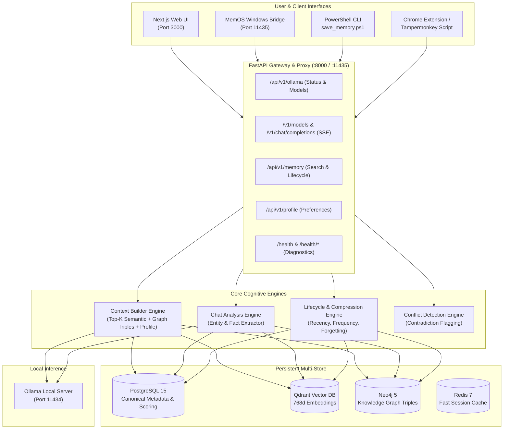

# MemOS — Complete Technical Architecture

> **System Overview:** Local-first persistent memory lifecycle and context injection engine for Local LLMs.

---

## 🏛️ System Architecture Diagram

---

## 📦 Multi-Store Roles & Division of Responsibilities

1. **PostgreSQL 15 (Canonical Relational Metadata)**:
   - Tables: `users`, `chats`, `messages`, `memories`, `user_profiles`, `analysis_history`.
   - Stores lifecycle mathematical scores (`importance_score`, `confidence_score`, `access_count`, `status`).

2. **Qdrant Vector DB (Semantic Vector Indexing)**:
   - Collection: `memory_vectors`.
   - Stores dense embeddings generated via local `nomic-embed-text` with cosine similarity filtering.

3. **Neo4j 5 (Associative Knowledge Graph)**:
   - Nodes: `User`, `Project`, `Technology`, `Skill`, `Concept`.
   - Edges: `[:DEVELOPING]`, `[:USES]`, `[:PREFERS]`, `[:SKILLED_IN]`.

4. **Redis 7 (Low-Latency Cache)**:
   - Used for quick session lookup, rate limiting, and temporary token streams.
