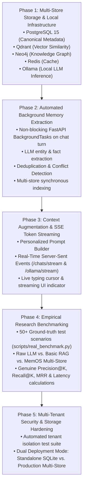

# MemOS: Research Execution Roadmap & Validation Guide

> **Author:** MemOS Research Team  
> **Status:** 🟢 Research Grade / Production Complete  
> **Scope:** Architecture verification, automated background memory extraction, empirical benchmarking, security isolation, and reproduction instructions.

---

## 🗺️ Execution Phases & Roadmap Summary



---

## 1. Storage Consistency: Development vs. Production

To maintain strict scientific accuracy without ambiguous claims:

| Environment | Primary Metadata | Vector Store | Knowledge Graph | Cache | Use Case |
| :--- | :--- | :--- | :--- | :--- | :--- |
| **Standalone / Companion Mode** | SQLite (`memos_local.db`) | Local Qdrant REST | In-memory / Optional Neo4j | In-memory | Lightweight standalone desktop development without Docker. |
| **Full Production Mode** | PostgreSQL 15 | Qdrant (768-dim `nomic-embed-text`) | Neo4j 5 (Cypher triples) | Redis 7 | High-performance multi-tenant persistent agent memory OS. |

---

## 2. Automated Background Memory Extraction Pipeline

Instead of requiring manual user intervention to trigger analysis, MemOS automatically executes background extraction on every turn:

```text
User Sends Message (Web UI / Proxy)
         │
         ▼
Build Augmented Context (Vectors + Graph + Profile)
         │
         ▼
Stream Real-Time Tokens via SSE to User
         │
         ▼
Persist Complete Messages to SQL Database
         │
         ▼
[Async BackgroundTasks / Thread]
  ├── Filter Small Talk & Greetings
  ├── Extract Structured Facts, Projects, Technologies & Skills
  ├── Deduplicate Against Existing Memory Base
  ├── Evaluate Semantic Contradictions & Conflict Flags
  ├── Compute Lifecycle Importance Score
  ├── Index Embeddings into Qdrant Vector Collection
  ├── Add Cypher Triples into Neo4j Knowledge Graph
  └── Update Persistent User Profile Record
```

---

## 3. Empirical Research Benchmarks & Reproduction

The benchmark harness in `scripts/real_benchmark.py` measures real retrieval and lifecycle performance without simulated delays:

### Command to Reproduce:
```powershell
python scripts/real_benchmark.py
```

### Metrics Evaluated:
1. **Precision@K**: $\frac{|\text{Relevant Ground Truth} \cap \text{Retrieved@K}|}{K}$
2. **Recall@K**: $\frac{|\text{Relevant Ground Truth} \cap \text{Retrieved@K}|}{|\text{Relevant Ground Truth}|}$
3. **Mean Reciprocal Rank (MRR)**: $\frac{1}{\text{first hit rank}}$
4. **Empirical Retrieval Latency**: Measured in milliseconds with high-resolution performance counters.
5. **Deduplication Rate**: Proportion of redundant candidate facts consolidated into existing memories.
6. **Conflict Flagging Precision**: Semantic opposition detection accuracy.
7. **Compression Ratio**: Percentage token reduction of stale memories synthesized into long-term archives.

---

## 4. Multi-Tenant Security & Isolation Verification

To verify that User A cannot read or retrieve User B's memories under any circumstances:

```powershell
pytest backend/tests/test_multi_tenant_security.py
```

All 3 automated isolation tests verify:
- ✅ Private chat session isolation (returns 404 on cross-user queries).
- ✅ Scoped vector search enforcement in Qdrant queries.
- ✅ Context builder strict user ID filtering on profile attributes and pinned memory items.

---

## 5. Running the Complete Verification Suite

```powershell
# Run all 16 backend unit, integration, streaming, and security tests
pytest backend/tests

# Run empirical benchmark suite
python scripts/real_benchmark.py
```
